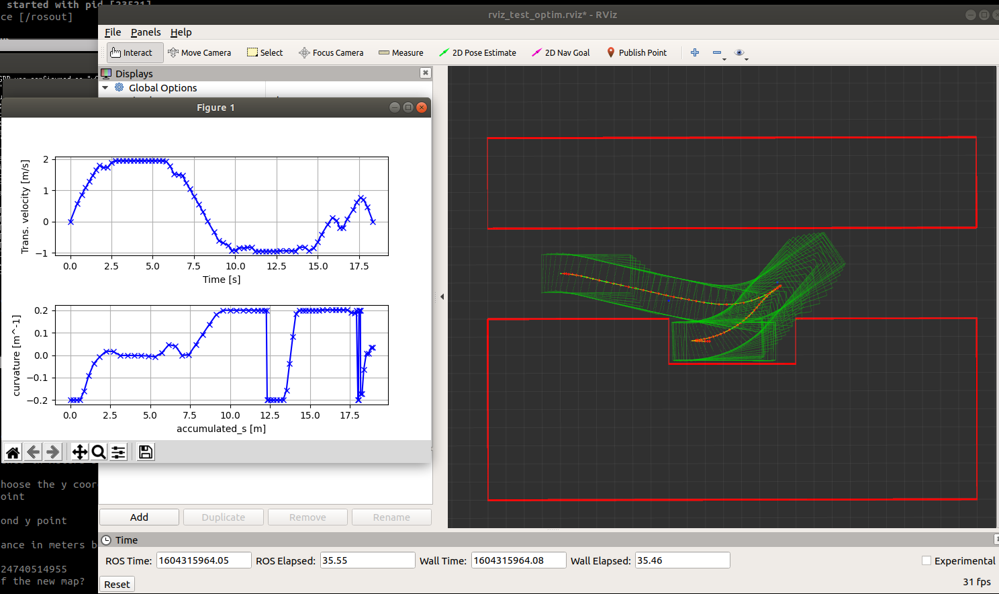

# teb_melodic_workspace

**Dependencies:**

 * Melodic ROS (http://wiki.ros.org/melodic/Installation/Ubuntu)
 * Add current folder into ros package folder. `export ROS_PACKAGE_PATH=/home/YOUR_PATH/src/:/opt/ros/melodic/share`
 * *navigation stack* package in melodic version `sudo apt-get install ros-melodic-navigation`
 * *stage* package in melodic version `sudo apt-get install ros-melodic-stage-ros`
 * *teb dependency*:  `rosdep install teb_local_planner`
 * a few python dependency like numpy, matplotlib

**Testing_procedures:**
1. run "catkin_make" in this folder
2. run "source /opt/ros/melodic/setup.bash" and "source devel/setup.bash" in every terminal used, better have it in your bashrc
3. run "roslaunch teb_local_planner test_optim_node.launch", and here we go

**Note:**
1. Two blue dots as Via points serve as a rough global plan. The blue points is harded-coded, only for the starting point in the grap below
2. **TEB is doing fine on curvature below with computation time of 50ms with dt=0.3**

**TODO:**
1. ~~[Done]Setup env with perfect localization and perception without ros-stage~~
2. ~~[Done]Visualize the obstacle~~
3. ~~[Done]Setup configuration accordng to paper experiment setups~~
4. ~~[Done]Testing script on curvature performance~~
5. [Done]Single starting position testing setup finished for curvature and time consumption benchmark with man-feed global plan by "Via points"(the blue dots on the graph)
6. [WIP][To_Be_Decided]Muliple starting position testing,
    a. Awaiting integration of global planner (make map, dive deep into code to integrate tf, map_server, costmap2d and global planner)
    b. Or switching back to ros-stage simulator(resetup the configuration, get rid of noise of perception and localization error, write a script to send start and goal pose, write a script to capture the very first frame of planning trajectory(as ros-stage will drive the car to goal, thus changing the "start" position setups))

**Archived Test Setup:**
1. With ros-state simulation env run "roslaunch teb_local_planner_testing robot_carlike_in_stage.launch", and here we go (Clearly, Teb is doing crazy here because the inaccurate and jumpping localization and perception)

2. With self-constructed env inspired by original test_optim_node.cpp which is pure test setup for the planner only.
Note: TEB is local planner. When testing it alone without a simulation environment like "stage", The TEB is using start-to-end straight line as the local optimization initials by default, thus obstacle collision failure could happen in below setups, will add a global planner soon

